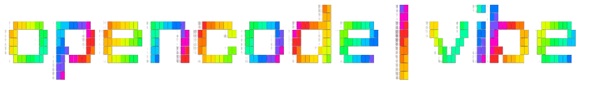

Next.js 16 rebuild of the OpenCode web application. Real-time chat UI with streaming message display, SSE sync, and React Server Components.

> **Warning:** This project uses Next.js 16 canary - bleeding edge. Catppuccin-themed because we're not savages.

## Quick Start

**Prerequisites:** [Bun](https://bun.sh) v1.3+ and [OpenCode CLI](https://github.com/sst/opencode).

1. **Start OpenCode in your project:**
   Navigate to the project you want to work on and keep this running:
   ```bash
   cd /path/to/your/project
   opencode
   ```

2. **Start the Web UI:**
   Clone this repo, install, and run:
   ```bash
   git clone https://github.com/joelhooks/opencode-vibe.git
   cd opencode-vibe
   bun install
   bun dev
   ```

3. **Open Browser:**
   Go to `http://localhost:8423`

---

## Features

- **World stream architecture** - Push-based reactive state via `createWorldStream()`
- **Multi-server discovery** - Finds all running OpenCode processes automatically via `lsof`
- **Cross-process messaging** - Send from web UI, appears in your TUI
- **Real-time streaming** - Messages stream in as the AI generates them
- **SSE sync** - All updates pushed via Server-Sent Events
- **Slash commands** - Type `/` for actions like `/fix`, `/test`, `/refactor`
- **File references** - Type `@` to fuzzy-search and attach files as context
- **Catppuccin theme** - Latte (light) / Mocha (dark) with proper syntax highlighting

---

## Tech Stack

| Layer          | Technology            | Why                                 |
| -------------- | --------------------- | ----------------------------------- |
| **Runtime**    | [Bun](https://bun.sh) | Fast all-in-one runtime             |
| **Framework**  | Next.js 16            | React Server Components, App Router |
| **Bundler**    | Turbopack             | Next-gen bundler                    |
| **Language**   | TypeScript 5+         | Type safety                         |
| **Linting**    | oxlint                | Fast Rust-based linter              |
| **Formatting** | Biome                 | Fast formatter                      |
| **Styling**    | Tailwind CSS          | Utility-first CSS                   |
| **State**      | effect-atom           | Reactive world stream with Effect   |
| **SDK**        | @opencode-ai/sdk      | OpenCode API client                 |

---

## Contributing

See **[CONTRIBUTING.md](CONTRIBUTING.md)** for development workflow, architecture docs, and project structure.

## License

This project is licensed under the MIT License - see the **[LICENSE](LICENSE)** file for details.
